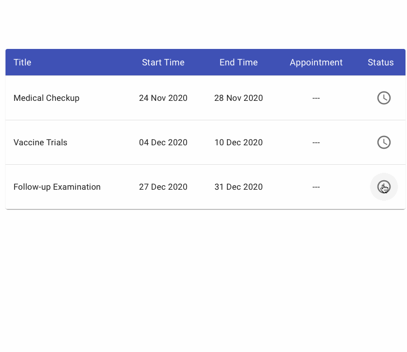
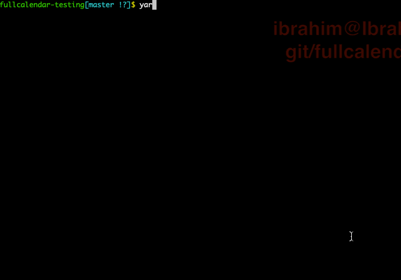

# FullCalendar Appointments Scheduling App

> A ReactJS app showing basic scheduling appointments functions using FullCalendar package [fullcalendar.io/](https://fullcalendar.io/)

## [Demo](https://ibrahim.github.io/fullcalendar/)



## Features
- Display available time slots.
- Open calendar to schedule an appointment in selected time slot.
- Validation of scheduling according to business rules with Alert messages.
- Drag appointment to adjust its time.
- Confirm and remove appointments.

## Technical Features
- The React app state is managed using React context API and React custom hook
- This custom hook is exporting all the actions, selectors requrired by the app.
- Placing the state, reducer, actions, and selectors outside the components made testing easier like Redux.





## Build Setup

``` bash
# install dependencies
yarn install

# serve at localhost:3000
yarn start

# run unit tests
yarn test

```

